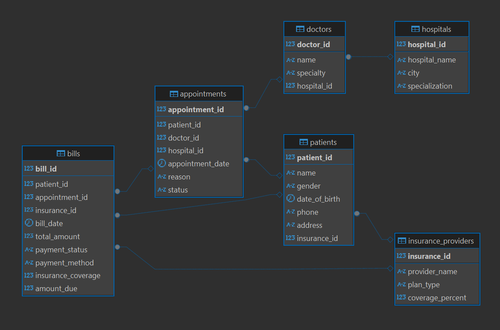
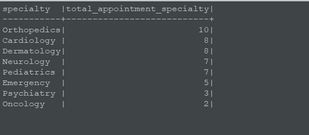
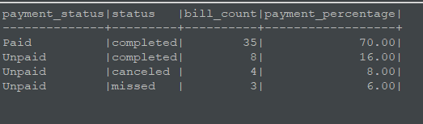
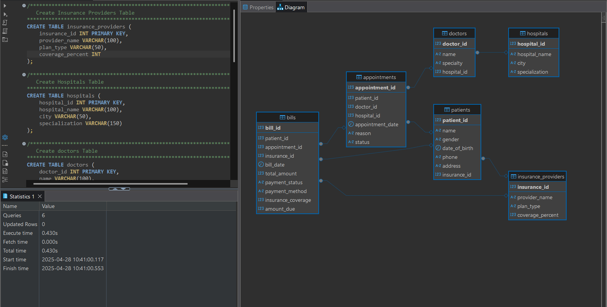
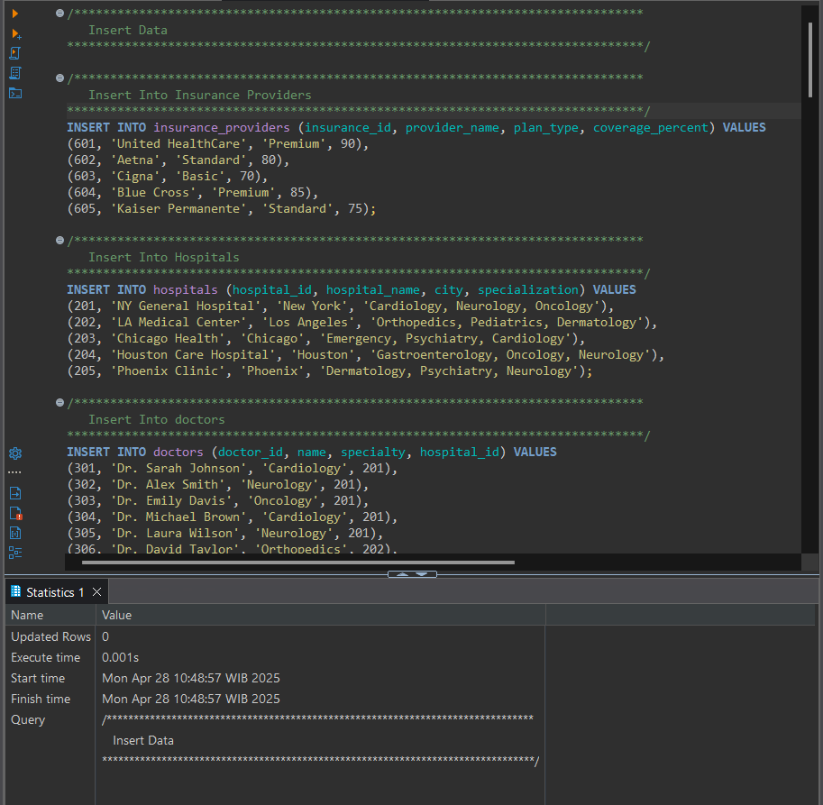

# Simple Hospital Data Insights with SQL (Mock Data)
A project demonstrating SQL analysis on mock hospital data, providing insights into hospital revenue, appointments, and patient information.

## Objectives
1. **Track Hospital Revenue**: Analyze total revenue from appointments, considering patient payments and insurance coverage.

2. **Appointment Analysis**: Assess appointment statistics by specialization and doctor performance.

3. **Doctor Performance**: Identify the top-performing doctors based on the number of completed appointments.

4. **Insurance Coverage**: Examine the distribution of insurance providers and their coverage across patients.

5. **Payment Status Monitoring**: Track the payment status of patient bills and calculate the proportion of paid versus unpaid bills.


## Data Source
This project uses mock data, generated only for the purpose of demonstrating how the system works. The data does not represent real patients, doctors, or institutions.


The database consists of the following tables:

1. Insurance Providers
    - `insurance_id`: Unique identifier for insurance providers.
    - `provider_name`: Name of the insurance provider.
    - `plan_type`: Type of insurance plan (e.g., Premium, Standard).
    - `coverage_percent`: Percentage of coverage for claims.

2. Hospitals
    - `hospital_id`: Unique identifier for hospitals.
    - `hospital_name`: Name of the hospital.
    - `city`: Location of the hospital.
    - `specialization`: Medical specialties offered by the hospital (e.g., Cardiology, Neurology).

3. Doctors
    - `doctor_id`: Unique identifier for doctors.
    - `name`: Name of the doctor.
    - `specialty`: Medical specialty of the doctor.
    - `hospital_id`: The hospital to which the doctor is affiliated.

4. Patients
    - `patient_id`: Unique identifier for patients.
    - `name`: Name of the patient.
    - `gender`: Gender of the patient.
    - `date_of_birth`: Date of birth.
    - `phone`: Contact number.
    - `address`: Residential address.
    - `insurance_id`: Insurance provider associated with the patient.

5. Appointments
    - `appointment_id`: Unique identifier for the appointment.
    - `patient_id`: Patient associated with the appointment.
    - `doctor_id`: Doctor associated with the appointment.
    - `hospital_id`: Hospital where the appointment occurs.
    - `appointment_date`: Date of the appointment.
    - `reason`: Reason for the appointment.
    - `status`: Status of the appointment (e.g., completed, cancelled). 

6. Bills
    - `bill_id`: Unique identifier for the bill.
    - `patient_id`: Patient associated with the bill.
    - `appointment_id`: Appointment associated with the bill.
    - `insurance_id`: Insurance provider that covers part of the bill.
    - `bill_date`: Date when the bill was created.
    - `total_amount`: Total amount of the bill.
    - `payment_status`: Payment status of the bill (e.g., Paid, Pending).
    - `payment_method`: Method of payment (e.g., Credit Card).
    - `insurance_coverage`: Amount covered by insurance.
    - `amount_due`: Amount remaining for the patient to pay.


## Technologies
- **MySQL** – for database management.
- **DBeaver** – as the database visualization and query tool.
- **Docker** – to containerize and manage the MySQL database environment.


## SQL Analysis
This project performs key analyses on hospital management data to uncover important insights about appointments, revenues, doctors, patients, and billing statuses. Below are the SQL queries used, along with explanations:

### 1. Hospital Revenue Analysis 
**Pourpose**:      
Identify which hospitals generate the most revenue from paid appointments.    

```sql
WITH AppointmentHospital AS (
SELECT 
    appointments.appointment_id,
    hospitals.hospital_name
FROM 
    appointments
JOIN 
    hospitals ON appointments.hospital_id = hospitals.hospital_id
)
SELECT 
    AppointmentHospital.hospital_name, 
    SUM(bills.total_amount) AS total_revenue
FROM 
    AppointmentHospital
JOIN 
    bills ON AppointmentHospital.appointment_id = bills.appointment_id
WHERE 
    bills.payment_status = 'Paid'
GROUP BY 
    AppointmentHospital.hospital_name
ORDER BY 
    total_revenue DESC;
```

**Query Description**:      
Calculates the total revenue generated by each hospital based only on paid bills. 

**How :**
- **Joins** appointments with hospitals to link each appointment to a hospital.
- **Joins** the result with bills to get payment amounts.
- **Filters** only the bills where payment_status = 'Paid'.
- **Groups the data by** hospital and orders by the highest revenue.

**Result:**     


### 2. Number of Appointments by Specialization  
**Pourpose**:      
Analyze which medical specialties have the highest number of appointments.

```sql
WITH AppointmentDoctorCount AS (
SELECT 
    doctor_id,
    COUNT(appointment_id) AS appointment_count
FROM 
    appointments 
GROUP BY 
    doctor_id
)
SELECT 
    doctors.specialty,
    SUM(AppointmentDoctorCount.appointment_count) AS total_appointment_specialty
FROM 
    AppointmentDoctorCount
JOIN 
    doctors ON doctors.doctor_id = AppointmentDoctorCount.doctor_id
GROUP BY 
    doctors.specialty
ORDER BY 
    total_appointment_specialty DESC;
```

**Query Description**:      
Finds the total number of appointments grouped by doctor specialization.

**How :**
- **Counts** how many appointments each doctor handled.
- **Joins** this data with the doctors table to find each doctor's specialization.
- **Aggregates total appointments** per specialty and sorts the results by popularity.

**Result:**     


### 3. Top 5 Doctors with the Most Completed Appointments       
**Pourpose**:      
Highlight the most active doctors based on completed appointments.

```sql
SELECT 
	doctors.name,
	COUNT(appointments.appointment_id) AS appointment_count
FROM 
	doctors
JOIN 
	appointments ON appointments.doctor_id = doctors.doctor_id
WHERE
	appointments.status = 'completed'
GROUP BY 
	doctors.name
ORDER BY 
	appointment_count DESC
LIMIT 5;
```

**Query Description**:      
Lists the top 5 doctors who completed the most appointments.

**How :**
- **Joins** doctors and appointments.
- **Filters** only appointments with a status = 'completed'.
- **Counts** the number of completed appointments per doctor.
- **Orders by** appointment count in descending order and limits the output to the top 5.

**Result:**     


### 4. Most Common Insurance Providers for Patients
**Pourpose**:      
Understand which insurance companies are most common among patients.

```sql
SELECT
	insurance_providers.provider_name,
	COUNT(patients.patient_id) AS patient_count
FROM
	insurance_providers
JOIN 
	patients ON patients.insurance_id = insurance_providers.insurance_id 
GROUP BY
	insurance_providers.provider_name
ORDER BY 
	patient_count DESC;
```

**Query Description**:      
Identifies the most popular insurance providers among patients.

**How :**
- **Joins** patients with insurance_providers using the insurance ID.
- **Counts** the number of patients per insurance provider.
- **Orders results by** the largest patient counts.

**Result:**     


### 5. Payment Status Analysis
**Pourpose**:      
Analyze the distribution of payment statuses

```sql
SELECT 
    bills.payment_status,
    appointments.status,
    COUNT(bills.bill_id) AS bill_count,
    ROUND(
        (COUNT(bills.bill_id) * 100.0) / 
        SUM(COUNT(bills.bill_id)) OVER(), 2
    ) AS payment_percentage
FROM 
    bills
JOIN 
    appointments ON bills.appointment_id = appointments.appointment_id 
GROUP BY 
    bills.payment_status, appointments.status
ORDER BY 
    bill_count DESC;
```

**Query Description**:      
Summarizes the distribution of bill payment statuses, showing both count and percentage.

**How :**
- **Joins** bills with appointments.
- **Groups data by** both payment_status and appointment status.
- **Counts** how many bills fall under each payment status.
- **Calculates** what percentage each payment status represents out of the total bills.
- **Orders results by** the highest bill count.

**Result:**     



## How to Use
### 1. Clone the Repository
```bash
git clone https://github.com/alfonharyos/Simple-Hospital-Data-Insights-with-SQL.git
cd Simple-Hospital-Data-Insights-with-SQL
```

### 2. Docker Compose Setup
To customize the MySQL connection settings in Docker Compose, you need to modify the following parameters in the docker-compose.yml file:
- `ports`: Change the host port if needed.
- `MYSQL_ROOT_PASSWORD`: Set this to your root password.
- `MYSQL_USER`: Set this to your MySQL database username.
- `MYSQL_PASSWORD`: Set this to your password.
- `MYSQL_DATABASE`: Set this to your database name.
```yaml
services:
  mysql:
    image: mysql:8.0
    container_name: healthcare-mysql # Container name
    ports:
      - "3307:3306"  # host port
    environment:
      MYSQL_DATABASE: healthcare_db  # Database name
      MYSQL_USER: myuser  # Username
      MYSQL_PASSWORD: mypassword  # Password
      MYSQL_ROOT_PASSWORD: mypassword  # Root password
    volumes:
      - mysql_data:/var/lib/mysql

volumes:
  mysql_data:
```
To apply the changes, save the `docker-compose.yml` file, then run:
```bash
docker-compose up -d
```

### 3. DBeaver Connection Setup
- Open DBeaver (connect to the MySQL).
- Create a new connection to:
    - Host: `localhost`      
    (if you're running Docker on your local machine)
    - Port: `3307`      
    (the port you specified in the `ports` section)
    - User: `myuser`        
    (the username you specified in `MYSQL_USER`)
    - Password: `mypassword`        
    (the password you specified in `MYSQL_PASSWORD`)
    - Database: `healthcare_db`         
    (the name of the database you specified in `MYSQL_DATABASE`)

### 4. Import Schema and Data
Once connected to the MySQL instance in DBeaver, you can manually execute the SQL files.

- Create Tables from healthcare-model.sql
    1. Open the healthcare-model.sql file in DBeaver. You can do this by clicking File → Open File, and selecting the healthcare-model.sql file.
    2. Once opened, click the Execute SQL Script button (or press Ctrl+Enter).
    3. The SQL script will run, creating the necessary tables in the library_db database.
    

- Insert Data from healthcare-data.sql
    1. Open the healthcare-data.sql file in DBeaver, just like you did for the previous file.
    2. Execute the SQL script to insert data into the tables by clicking the Execute SQL Script button (or pressing Ctrl+Enter).
    

### 5. Run SQL Analysis from healthcare-analysis.sql
After the tables are created and the data is inserted, you can run the analysis directly from the healthcare-analysis.sql file.

1. Open the healthcare-analysis.sql file in DBeaver.
2. Click on the Execute SQL Script button (or press Ctrl+Enter) to run the queries.
3. The analysis will produce results such as hospital revenue, appointment trends, and doctor performance.
4. After running the queries, the results will appear in the Results tab at the bottom of the DBeaver window.
